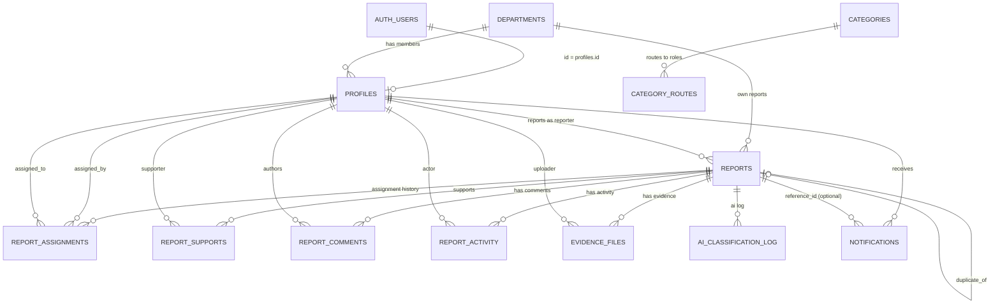

# Database Design

> PostgreSQL database schema design for the Campus Pulse system.
> **Status: APPROVED — v1.0. Migrations generated (14 files under `supabase/migrations/`), not yet applied to any database.**
> **v2 proposal (communities + Linways integration): §9 below — decisions LOCKED, awaiting final approval; no migrations changed.**

---

## Table of Contents

1. [Design Principles](#1-design-principles)
2. [Entity Relationship Diagram](#2-entity-relationship-diagram)
3. [Table Definitions](#3-table-definitions)
4. [Enums](#4-enums)
5. [Indexes](#5-indexes)
6. [Migrations Strategy](#6-migrations-strategy)
7. [Seed Data](#7-seed-data)
8. [Implementation Rules](#8-implementation-rules)

---

## 1. Design Principles

- Routing is decoupled from categories: a category may route to **multiple roles**, resolved in priority order via `category_routes`. `categories` **does not** contain an `assigned_role`.
- Assignment history is preserved: `report_assignments` replaces a single `assigned_to` column on `reports`. The current assignment is the row with `active = true`.
- `reports.semester` and `reports.section` are **snapshots** captured at report creation, so historical reports are unaffected when a student changes semester/section.
- Status changes are recorded in `report_activity` with `activity_type = 'status_change'` and `metadata` containing `from_status` / `to_status`. There is **no** `status_updates` table.
- One student may support a report only once (`UNIQUE(report_id, supporter_id)` on `report_supports`).
- `profiles` extends Supabase `auth.users` (1:1, `id` references `auth.users.id`).

---

## 2. Entity Relationship Diagram



---

## 3. Table Definitions

### 3.1 departments

| Column     | Type        | Constraints        |
|------------|-------------|--------------------|
| id         | uuid        | PRIMARY KEY        |
| name       | text        | NOT NULL           |
| code       | text        | UNIQUE, NOT NULL   |
| created_at | timestamptz | NOT NULL           |

### 3.2 categories

| Column     | Type        | Constraints |
|------------|-------------|-------------|
| id         | uuid        | PRIMARY KEY |
| name       | text        | NOT NULL    |
| created_at | timestamptz | NOT NULL    |

> **Note:** `categories` does **not** contain `assigned_role`. Routing is handled separately through `category_routes`.

### 3.3 category_routes

| Column     | Type         | Constraints                              |
|------------|--------------|------------------------------------------|
| id         | uuid         | PRIMARY KEY                              |
| category_id | uuid        | FOREIGN KEY → categories.id, NOT NULL    |
| role       | user_role    | NOT NULL                                 |
| priority   | integer      | NOT NULL                                 |
| created_at | timestamptz  | NOT NULL                                 |

> Purpose: allows one category to route to multiple roles. `priority` determines routing order.

### 3.4 profiles

Extends Supabase `auth.users`.

| Column        | Type        | Constraints                            |
|---------------|-------------|----------------------------------------|
| id            | uuid        | PRIMARY KEY, FOREIGN KEY → auth.users.id |
| email         | text        | NOT NULL                               |
| full_name     | text        | NOT NULL                               |
| role          | user_role   | NOT NULL                               |
| department_id | uuid        | FOREIGN KEY → departments.id           |
| semester      | integer     | NULLABLE                               |
| section       | text        | NULLABLE                               |
| student_id    | text        | UNIQUE, NULLABLE                       |
| created_at    | timestamptz | NOT NULL                               |

### 3.5 reports

Central complaint/report table.

| Column        | Type         | Constraints                                  |
|---------------|--------------|----------------------------------------------|
| id            | uuid         | PRIMARY KEY                                  |
| reporter_id   | uuid         | FOREIGN KEY → profiles.id, NOT NULL          |
| report_type   | report_type  | NOT NULL                                     |
| title         | text         | NOT NULL                                     |
| description   | text         | NOT NULL                                     |
| category_id   | uuid         | FOREIGN KEY → categories.id, NOT NULL        |
| subcategory   | text         | NULLABLE                                     |
| priority      | priority     | NOT NULL                                     |
| status        | report_status| NOT NULL                                     |
| department_id | uuid         | FOREIGN KEY → departments.id, NOT NULL       |
| semester      | integer      | NULLABLE                                     |
| section       | text         | NULLABLE                                     |
| duplicate_of  | uuid         | NULLABLE, self-reference → reports.id        |
| ai_confidence | float        | NULLABLE                                     |
| deleted_at    | timestamptz  | NULLABLE (soft delete)                       |
| created_at    | timestamptz  | NOT NULL                                     |
| updated_at    | timestamptz  | NOT NULL                                     |

> **IMPORTANT:** `semester` and `section` are SNAPSHOTS captured when the report is created. Historical reports are not affected when a student changes semester/section.

### 3.6 report_assignments

Replaces a single `assigned_to` column. Preserves assignment/reassignment history; the current assignment is the row with `active = true`.

| Column      | Type        | Constraints                              |
|-------------|-------------|------------------------------------------|
| id          | uuid        | PRIMARY KEY                              |
| report_id   | uuid        | FOREIGN KEY → reports.id, NOT NULL       |
| assigned_by | uuid        | FOREIGN KEY → profiles.id, NOT NULL      |
| assigned_to | uuid        | FOREIGN KEY → profiles.id, NOT NULL      |
| assigned_at | timestamptz | NOT NULL                                 |
| active      | boolean     | NOT NULL                                 |
| notes       | text        | NULLABLE                                 |

### 3.7 report_supports

| Column      | Type        | Constraints                                    |
|-------------|-------------|------------------------------------------------|
| id          | uuid        | PRIMARY KEY                                    |
| report_id   | uuid        | FOREIGN KEY → reports.id, NOT NULL             |
| supporter_id| uuid        | FOREIGN KEY → profiles.id, NOT NULL            |
| comment     | text        | NULLABLE                                       |
| created_at  | timestamptz | NOT NULL                                       |

> Constraint: `UNIQUE(report_id, supporter_id)` — one student can support a report only once.

### 3.8 report_comments

| Column     | Type        | Constraints                           |
|------------|-------------|---------------------------------------|
| id         | uuid        | PRIMARY KEY                           |
| report_id  | uuid        | FOREIGN KEY → reports.id, NOT NULL    |
| author_id  | uuid        | FOREIGN KEY → profiles.id, NOT NULL   |
| message    | text        | NOT NULL                              |
| created_at | timestamptz | NOT NULL                              |

### 3.9 report_activity

**This REPLACES the previously planned `status_updates` table.** Do not create a separate `status_updates` table.

| Column        | Type        | Constraints                           |
|---------------|-------------|---------------------------------------|
| id            | uuid        | PRIMARY KEY                           |
| report_id     | uuid        | FOREIGN KEY → reports.id, NOT NULL    |
| actor_id      | uuid        | FOREIGN KEY → profiles.id, NOT NULL   |
| activity_type | text        | NOT NULL                              |
| metadata      | jsonb       | NULLABLE                              |
| created_at    | timestamptz | NOT NULL                              |

> Status changes are represented as `activity_type = 'status_change'`. Example metadata:
> ```json
> { "from_status": "pending", "to_status": "under_review" }
> ```

### 3.10 evidence_files

| Column      | Type        | Constraints                           |
|-------------|-------------|---------------------------------------|
| id          | uuid        | PRIMARY KEY                           |
| report_id   | uuid        | FOREIGN KEY → reports.id, NOT NULL    |
| file_url    | text        | NOT NULL                              |
| file_type   | text        | NOT NULL                              |
| uploaded_by | uuid        | FOREIGN KEY → profiles.id, NOT NULL   |
| created_at  | timestamptz | NOT NULL                              |

### 3.11 ai_classification_log

| Column             | Type        | Constraints                           |
|--------------------|-------------|---------------------------------------|
| id                 | uuid        | PRIMARY KEY                           |
| report_id          | uuid        | FOREIGN KEY → reports.id, NOT NULL    |
| raw_input          | text        | NOT NULL                              |
| classification     | jsonb       | NOT NULL                              |
| priority_prediction| jsonb       | NOT NULL                              |
| duplicate_check    | jsonb       | NOT NULL                              |
| model_version      | text        | NOT NULL                              |
| created_at         | timestamptz | NOT NULL                              |

> Example `classification`:
> ```json
> { "category": "...", "confidence": 0.0, "reasoning": "..." }
> ```
> Example `priority_prediction`:
> ```json
> { "priority": "...", "confidence": 0.0 }
> ```
> Example `duplicate_check`:
> ```json
> { "is_duplicate": false, "similar_report_id": null, "similarity_score": 0.0 }
> ```

### 3.12 notifications

| Column      | Type        | Constraints                             |
|-------------|-------------|-----------------------------------------|
| id          | uuid        | PRIMARY KEY                             |
| user_id     | uuid        | FOREIGN KEY → profiles.id, NOT NULL     |
| title       | text        | NOT NULL                                |
| body        | text        | NOT NULL                                |
| type        | text        | NOT NULL                                |
| reference_id| uuid        | NULLABLE                                |
| read        | boolean     | NOT NULL                                |
| created_at  | timestamptz | NOT NULL                                |

> `type` + `reference_id` allow notifications to reference reports, comments, status changes, etc.

---

## 4. Enums

### 4.1 user_role

| Value        |
|--------------|
| student      |
| hod          |
| technician   |
| operations   |
| admin        |

### 4.2 report_type

| Value     |
|-----------|
| community |
| private   |

### 4.3 report_status

| Value       |
|-------------|
| pending     |
| under_review|
| in_progress |
| resolved    |
| rejected    |
| closed      |

### 4.4 priority

| Value |
|-------|
| low   |
| medium|
| high  |

---

## 5. Indexes

The approved schema mandates the following uniqueness constraints (implemented as unique indexes):

- `departments.code` — unique
- `profiles.student_id` — unique
- `report_supports(report_id, supporter_id)` — unique

Additional indexes (foreign-key lookup support) will be defined during migration generation for the following columns:

- `profiles.department_id`
- `category_routes.category_id`
- `reports.reporter_id`, `reports.category_id`, `reports.department_id`, `reports.duplicate_of`
- `report_assignments.report_id`, `report_assignments.assigned_to`
- `report_supports.report_id`
- `report_comments.report_id`
- `report_activity.report_id`
- `evidence_files.report_id`
- `ai_classification_log.report_id`
- `notifications.user_id`

---

## 6. Migrations Strategy

- Ordered Supabase migration files under `supabase/migrations/` (one logical unit per file, timestamped).
- Migration order: enums → departments → categories → category_routes → profiles → reports → report_assignments → report_supports → report_comments → report_activity → evidence_files → ai_classification_log → notifications.
- All tables created with full NOT NULL / FK / UNIQUE constraints as documented above.
- Seed data loaded as a separate step per the approved development order (Phase step 4).

---

## 7. Seed Data

Deferred — defined and approved as part of the Seed Data phase (step 4 of the approved development order). No seed content is specified in this schema document.

---

## 8. Implementation Rules

- Do not add fields that are not listed above.
- Do not remove approved fields.
- Do not redesign relationships.
- Do not create `status_updates`.
- Do not add `assigned_to` directly to `reports`.
- Do not put `assigned_role` inside `categories`.
- RLS, authentication, and AI are out of scope for this phase.

---

## 9. Proposed Schema Changes — v2 (Community & Linways Integration)

> **DECISIONS LOCKED — awaiting final approval. No migration files have been modified.**
> Full rationale and flows: `docs/architecture/LINWAYS_INTEGRATION_ARCHITECTURE.md`.

### 9.0 Locked decisions affecting the schema

1. **Community lifetime:** a separate community per **semester + section + batch** (`BCA 2024 S5 C` ≠ `BCA 2024 S6 C`).
2. **`reports.community_id`:** NOT NULL, snapshot of the reporter's community at report creation.
3. **`community_members`:** history preserved with `is_active`, `joined_at`, `left_at`.
4. **Attendance:** dashboard-only; no attendance tables.
5. **Staff:** provisioning OUT OF MVP; role architecture retained.
6. **Profile:** no new fields (`rollNo`, `phone`, `image` deferred).
7. **`community_pending`:** fallback kept; client never chooses its class.
8. **`course_code`:** independent from `departments`; no new FK.
10. **Linways secrets:** never stored in DB, files, logs, or docs.

### 9.1 New table: communities

One row per distinct academic class/section. Key: `(course_code, batch_year, semester, section)`.

| Column       | Type        | Constraints                                             |
|--------------|-------------|---------------------------------------------------------|
| id           | uuid        | PRIMARY KEY                                             |
| course_code  | text        | NOT NULL (e.g. `BCA`)                                   |
| batch_year   | integer     | NOT NULL (e.g. `2024`)                                  |
| semester     | text        | NOT NULL (e.g. `S5`)                                    |
| section      | text        | NOT NULL (e.g. `C`)                                     |
| display_name | text        | NOT NULL (e.g. `BCA 2024 S5 C`)                         |
| created_at   | timestamptz | NOT NULL                                                |

- `UNIQUE (course_code, batch_year, semester, section)` — idempotent get-or-create.
- No FK to `departments` (locked decision 8).

### 9.2 New table: community_members

| Column       | Type        | Constraints                                |
|--------------|-------------|--------------------------------------------|
| id           | uuid        | PRIMARY KEY                                |
| community_id | uuid        | FOREIGN KEY → communities.id, NOT NULL     |
| profile_id   | uuid        | FOREIGN KEY → profiles.id, NOT NULL        |
| is_active    | boolean     | NOT NULL                                   |
| joined_at    | timestamptz | NOT NULL                                   |
| left_at      | timestamptz | NULLABLE                                   |

- `UNIQUE (community_id, profile_id)` — one membership row per student per community; `is_active` marks the current one; history preserved.

### 9.3 Modified table: reports (one new column)

| Column       | Type | Constraints                                                              |
|--------------|------|--------------------------------------------------------------------------|
| community_id | uuid | FOREIGN KEY → communities.id, **NOT NULL** (snapshot of creator's community) |

### 9.4 Unchanged

All other tables (`departments`, `categories`, `category_routes`, `profiles`, `report_assignments`, `report_supports`, `report_comments`, `report_activity`, `evidence_files`, `ai_classification_log`, `notifications`) and all enums remain as approved in v1.0. `profiles` references its community through `community_members` (no denormalized column, no new fields — see proposal §I).

### 9.5 Migration impact (v2)

| Migration | Impact |
|---|---|
| `..._enums.sql` … `..._profiles.sql` | Valid, unchanged |
| `..._reports.sql` | MUST CHANGE — add `community_id` FK NOT NULL |
| `..._report_assignments.sql` … `..._notifications.sql` | Valid, unchanged |
| `..._indexes.sql` | MUST CHANGE — add `reports.community_id`, `community_members.profile_id` |
| NEW | `communities.sql`, `community_members.sql` (inserted between `profiles` and `reports` in order) |

Apply strategy: revise in place before first cloud apply (database is pristine). Pending final approval.
