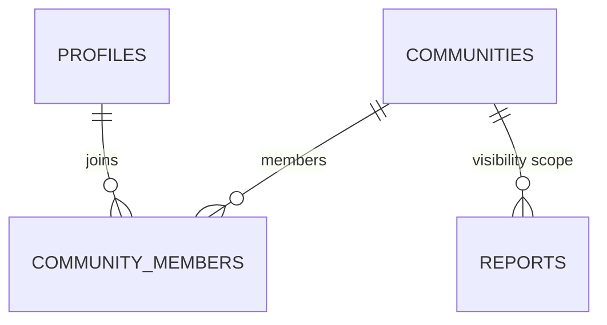

# Linways Integration & Community Architecture

> Design proposal for integrating college project with the college Linways system (UUCMS credentials) and the academic community model.
>
> **Status: DECISIONS LOCKED (items 1–10 approved conceptually).** This is the design
> proposal that `supabase/functions/linways-login/index.ts` implements.
> ⚠️ **Partly superseded — read `docs/decisions/ADR-001-Authentication.md` first.**
> The status line this banner replaces claimed "no code, no migrations"; both exist.
> Two specific claims are now false: the login response field is `supabase_session`,
> not `campus_pulse_jwt`, and the "short-lived **college project JWT**" phrasing
> throughout this document means a real GoTrue session (`access_token` +
> `refresh_token`, auto-refreshed), not a self-signed token. Item 5's "staff
> provisioning OUT OF MVP" is superseded by ADR-001 §2.6 — staff login is implemented,
> but its seed migration `20261005120000` has not been applied. Items 1–4 and 6–10
> still hold as originally decided.
> Based on the Linways investigation (confirmed via Chrome DevTools / HTTP inspection):

| Confirmed Linways endpoint | Method | Purpose |
|---|---|---|
| `/academics/api/v1/auth/student-login-credentials` | POST | Student login; returns `{ success, data: { accessToken, validLogin } }` + session cookies (`AUTH_SESSION`, `refresh_token`) |
| `/academics/api/v1/student/get-my-profile-details` | GET | Student profile: `name, rollNo, registerNo, programme, batchName, currentSem, image, email, phone` |
| `/academics/api/v1/student/get-my-attendance-summary` | GET | Overall attendance: `{ totalHours, attendedHours, totalPresent, attendancePercentage, isHourWiseEnabled }` |

**Observed sample data (one student):**
- `name: "SANTHOSH KRISHNA R"`, `rollNo: "24BCA-38"`, `registerNo: "U18IW24S0166"`
- `programme: "UG - BCA - BCA General"`, `batchName: "BCA 2024 C"`, `currentSem: "S5"`
- `attendancePercentage: 89.11`

---

## Table of Contents

- [A. Linways Authentication Architecture](#a-linways-authentication-architecture)
- [B. Linways Profile Integration](#b-linways-profile-integration)
- [C. Academic Community Model](#c-academic-community-model)
- [D. Community Membership Model](#d-community-membership-model)
- [E. Community / Report Visibility](#e-community--report-visibility)
- [F. Attendance Integration](#f-attendance-integration)
- [G. Mapping Linways batchName / currentSem to a Community](#g-mapping-linways-batchname--currentsem-to-a-community)
- [H. Community Representation (table / membership / other)](#h-community-representation)
- [I. How Profiles Reference the Community](#i-how-profiles-reference-the-community)
- [J. Attendance Storage Strategy](#j-attendance-storage-strategy)
- [K. Security Implications](#k-security-implications)
- [L. Token / Session Handling](#l-token--session-handling)
- [M. Required Changes to the Existing Database Schema](#m-required-changes-to-the-existing-database-schema)
- [N. Required Changes to the Development Roadmap](#n-required-changes-to-the-development-roadmap)
- [Migration Impact Summary](#migration-impact-summary)
- [Locked Decisions](#locked-decisions)
- [Remaining Open Questions](#remaining-open-questions)

---

## A. Linways Authentication Architecture

### A.1 Core principle

Students authenticate with their **Linways / UUCMS credentials**. college project **never persists the student's Linways password**, and **never commits or stores `AUTH_SESSION` cookies, access tokens, or refresh tokens** (not in the database, not in files, not in logs, not in documentation).

### A.2 Investigation: can Supabase Edge Functions hold a reliable in-memory session?

**Finding: No.** Supabase Edge Functions are stateless by design. Evidence from the investigation:

- Official architecture docs: *"No persistent state; each run is stateless, ideal for ephemeral tasks."* Each request runs in a **new V8 isolate** with its own memory heap.
- In-memory state is **per-isolate only**: *"The in-memory rooms map is local to one instance."* A `Map` created in one invocation is not visible to the next.
- **Cold starts and eviction are normal**: isolates are shut down after idle periods; the edge proxy routes each request to whichever instance is available — consecutive requests from the same user can hit **different isolates, regions, or instances** (globally distributed across 30+ data centers).
- **Warm-start reuse is best-effort, not guaranteed**: production logs show fresh workers booted even at low, sequential concurrency. In-memory caches/pooled connections inside a worker are documented as *not reliable optimizations* in production.
- CPU is budgeted per invocation (e.g. ~2 s CPU on paid plans); a per-request session lookup would consume a large share of every request's budget.

**Conclusion:** an in-memory Linways session map in an Edge Function would lose sessions arbitrarily (isolate eviction, deploy, scale-out), forcing random re-logins. It is rejected as the primary architecture.

### A.3 Options compared

| Option | Reliability | Security | Complexity | Verdict |
|---|---|---|---|---|
| **A. Edge Function in-memory session** | ❌ None (per-isolate, eviction, multi-instance) | Medium | Low | **Rejected** (A.2) |
| **B. Server-side persistent session store** (Postgres table / KV / S3 persistent storage) | ✅ High | ❌ **Stores Linways session secrets server-side — violates locked decision 10** (would require relaxing it) | Medium (encryption, TTL cleanup, revocation) | **Rejected for MVP under decision 10**; revisit only if central control becomes a hard requirement |
| **C. Split-token: server login handshake + client-held Linways session (recommended)** | ✅ High (session lives on the device, no server state) | Medium (secrets on device, encrypted at rest — same exposure as the college's existing PULSE app) | ✅ Lowest (no server session state at all) | **Recommended** |
| **D. Hybrid (server proxy + client-held)** | ✅ High | Same as C, plus every attendance call adds a server hop | Medium | Rejected — no benefit over C |

### A.4 Recommendation

**Option C — Split-token architecture: server login handshake + client-held Linways session.**

1. The **auth service** (stateless Edge Function) performs a **login handshake**: it calls Linways `student-login-credentials` with the student's credentials, fetches `get-my-profile-details`, derives the community, upserts the college project profile + membership (via `service_role`), and issues a short-lived **college project JWT**.
2. The Linways session cookies (`AUTH_SESSION`, `refresh_token`) captured during that single request are returned to the app **once** and stored in **FlutterSecureStorage** (encrypted). The server retains nothing.
3. The app uses:
   - **college project JWT** → Supabase APIs (RLS-protected reports, comments, etc.)
   - **Linways session** (device-held) → direct Linways calls for attendance (dashboard) — the exact pattern the college's existing PULSE app already uses in production.
4. **Password:** passed in-memory only to the handshake; never persisted, never logged.

Why this wins for MVP: highest reliability (no server session state to lose), strictest compliance with decision 10 (no Linways secrets stored server-side), lowest complexity, and a proven precedent inside the same college (PULSE). The accepted trade-off — Linways session secrets on the device — is mitigated by OS-level encrypted storage and is identical to the exposure of the app the college already ships.

### A.5 Proposed login flow

```mermaid
sequenceDiagram
    participant App as Flutter App
    participant AUTH as college project Auth Service (Edge Function, stateless)
    participant LIN as Linways API
    participant DB as Supabase (service_role)

    App->>AUTH: POST /auth/linways/login { username, password }
    Note over App: password only in memory, never stored
    AUTH->>LIN: POST /academics/api/v1/auth/student-login-credentials
    LIN-->>AUTH: { accessToken, validLogin } + Set-Cookie (AUTH_SESSION, refresh_token)
    AUTH->>LIN: GET /student/get-my-profile-details (with session)
    LIN-->>AUTH: name, registerNo, programme, batchName, currentSem, email
    AUTH->>AUTH: derive community (course, batch_year, semester, section)
    AUTH->>DB: upsert profile; get-or-create community + active membership
    AUTH-->>App: { supabase_session { access_token, refresh_token }, linways_session_cookies, profile, community }
    Note over App: Linways cookies + Supabase session stored in FlutterSecureStorage
    Note over AUTH: server discards Linways session — retains nothing
```

**Subsequent requests:**
- Reports/community data → app ↔ Supabase with college project JWT (RLS).
- Attendance → app ↔ Linways directly with device-held session cookies.

**Logout / expiry:** app discards both the college project JWT and the Linways cookies. On Linways `401`, the app drops the Linways session and prompts re-login (Linways has no client-triggered revocation; expiry is controlled by Linways).

---

## B. Linways Profile Integration

### B.1 Field mapping (from `get-my-profile-details`)

| college project `profiles` column | Linways source field | Notes |
|---|---|---|
| `full_name` | `name` | e.g. "SANTHOSH KRISHNA R" |
| `email` | `email` | nullable in Linways data |
| `student_id` (unique) | `registerNo` | institutional ID, e.g. "U18IW24S0166" |
| `role` | — (fixed) | `'student'` for this flow |
| `semester` / `section` | `currentSem` / parsed from `batchName` | also used for community derivation |
| `rollNo`, `phone`, `image` | available | **NOT added** (locked decision 6) |

`department_id` remains nullable for students (departments primarily scope staff/HOD assignment routing — see §M).

### B.2 Rules

- `profiles` upsert keyed by `auth.users.id` (auth-side user). The Linways `registerNo` is recorded as `student_id` but is **not** a college project primary key.
- Profile write is performed by the auth service using `service_role` — never by the client directly.

---

## C. Academic Community Model

### C.1 Definition (locked decision 1)

A **community** is one academic class/section for one batch/year in one semester: `(course_code, batch_year, semester, section)`.

**`BCA + 2024 + S5 + C` and `BCA + 2024 + S6 + C` are DIFFERENT communities.**

```
BCA 2024
  S1 → BCA A, BCA B, BCA C
  ...
  S5 → BCA A, BCA B, BCA C   ← e.g. "BCA 2024 C" (S5)
  S6 → BCA A, BCA B, BCA C   ← different communities
BBA / BCom → same pattern
```

`BCA 2024 C` must not see reports of `BCA 2024 A`, `BCA 2024 B`, `BCA 2025 C`, `BBA`, or `BCom`.

### C.2 Relational design



**`communities`** — one row per distinct class/section:

| Column | Type | Constraints |
|---|---|---|
| id | uuid | PRIMARY KEY |
| course_code | text | NOT NULL (e.g. `BCA`) |
| batch_year | integer | NOT NULL (e.g. `2024`) |
| semester | text | NOT NULL (e.g. `S5`) |
| section | text | NOT NULL (e.g. `C`) |
| display_name | text | NOT NULL (e.g. `BCA 2024 S5 C`) |
| created_at | timestamptz | NOT NULL |

- `UNIQUE (course_code, batch_year, semester, section)` — prevents duplicates, enables idempotent get-or-create.
- `display_name` is derived, not user-typed.
- **No FK to `departments`** (locked decision 8): `course_code` is independent for MVP.

**`community_members`** — join records with history (locked decision 3):

| Column | Type | Constraints |
|---|---|---|
| id | uuid | PRIMARY KEY |
| community_id | uuid | FOREIGN KEY → communities.id, NOT NULL |
| profile_id | uuid | FOREIGN KEY → profiles.id, NOT NULL |
| is_active | boolean | NOT NULL |
| joined_at | timestamptz | NOT NULL |
| left_at | timestamptz | NULLABLE |

- `UNIQUE (community_id, profile_id)` — one membership row per student per community; history is preserved; `is_active` marks the current one.
- Moving to a new semester ⇒ new community + new membership row; old membership set inactive (`is_active = false`, `left_at` set).

### C.3 Why a table (not an enum, not a text column)

- The set of classes is open-ended (every course/year/semester/section), so an enum is impossible.
- A table gives referential integrity, unique constraints, and a stable id that `reports` can snapshot.

---

## D. Community Membership Model

- Membership is recorded at login time by the auth service (`get-or-create community → upsert membership`).
- **"Join the community" is automatic** — derived from Linways data, never chosen by the student.
- A student is a member of exactly one **active** community at a time for MVP.
- **Staff profiles (hod/technician/operations/admin) provisioning is OUT OF MVP** (locked decision 5). The existing role architecture (`user_role` enum, `category_routes`) is retained untouched; only staff authentication/provisioning is deferred.
- If Linways data cannot be mapped safely to a community, the student is **not** allowed to pick a class (locked decision 7): marked `community_pending` for admin handling.

---

## E. Community / Report Visibility

- A report created by a student is **associated with the creator's community at creation time**: `reports.community_id` (FK → communities.id), **NOT NULL** (locked decision 2), snapshot semantics.
- Visibility rule (enforced in the RLS phase, not now):
  - Students see reports where `community_id` = their active community's id.
  - Students in other communities do **not** see them.
  - Staff see reports via assignment/routing rules (existing architecture: `category_routes`, `report_assignments`).
- `reports.semester` / `reports.section` snapshots remain (approved decision) as human-readable context; `community_id` is the authoritative isolation key.

---

## F. Attendance Integration

- Attendance is a **dashboard feature**, not a reporting subsystem (locked decision 4).
- The dashboard shows **overall attendance percentage only** (MVP): `attendancePercentage` from `get-my-attendance-summary` (e.g. `89.11`).
- No subject-wise attendance, timetable, marks, or daily schedule for MVP.
- **No attendance database tables** (locked decision 4).

**Flow** (the app holds the Linways session on-device):

```mermaid
sequenceDiagram
    participant App as Flutter App (Dashboard)
    participant LIN as Linways API
    App->>LIN: GET /student/get-my-attendance-summary (device-held session)
    LIN-->>App: { attendancePercentage: 89.11, ... }
    App->>App: display; cache in memory ~10-30 min
```

---

## G. Mapping batchName / currentSem to a Community

Parsing happens **server-side** (auth service), never trusting client input.

| Community field | Source | Rule (observed format) |
|---|---|---|
| `course_code` | `batchName` | leading alpha token, e.g. `BCA 2024 C` → `BCA` |
| `batch_year` | `batchName` | year token, e.g. `BCA 2024 C` → `2024` |
| `section` | `batchName` | trailing token, e.g. `BCA 2024 C` → `C` |
| `semester` | `currentSem` | e.g. `S5` |

- **Do not hard-code assumptions**: `"BCA 2024 C"` is one observed value; other courses/batches may differ (`programme` is a fallback source: `UG - BCA - BCA General` → course `BCA`).
- The derivation is a **small normalization layer** with an explicit, versioned rule set. If parsing fails or is ambiguous, login still succeeds but the student is marked `community_pending` (no auto-join) until an admin assigns the community — **never a silent wrong join, never client-chosen**.
- Auto-provisioning: if the derived community does not exist, the auth service creates it (idempotent get-or-create via the unique key).

---

## H. Community Representation

**Decision: `communities` table + `community_members` membership table** (see §C.2). This satisfies:
- open-ended class set (table, not enum)
- automatic join (membership at login)
- history when a class advances semesters (`is_active` + `left_at`)
- stable FK target for `reports.community_id`

Rejected alternatives: enum (closed set), single `profile.community_id` text (no integrity, no history), pure derivation with no persisted row (no referential integrity for reports, no admin override).

---

## I. How Profiles Reference the Community

**Decision:** via `community_members` (the active row), **not** a denormalized `profiles.community_id`. Single source of truth; no dual-write risk.

*Optional (flagged):* a denormalized `profiles.community_id` could speed common queries, at the cost of keeping two values in sync. **Not proposed for MVP.**

---

## J. Attendance Storage Strategy

**Decision (MVP): live fetch + short client-side cache — no database table.**

| Option | Verdict |
|---|---|
| Live fetch every dashboard open | Base behavior — app calls Linways directly with the device-held session |
| DB snapshot/cache table | Not needed for a dashboard value; adds sync/staleness concerns — rejected (locked decision 4) |
| **Hybrid (adopted)** | App caches the percentage in memory (TTL ~10–30 min) and shows the last known value when Linways is unreachable; no DB write |

Revisit DB caching only if attendance becomes a first-class reporting feature.

---

## K. Security Implications

- **Password:** transmitted in-memory only to the Linways login call; never logged, never persisted, discarded after login.
- **Session secrets:** `AUTH_SESSION`, `refresh_token`, `accessToken` live only in the device's FlutterSecureStorage (encrypted); returned once from the handshake; never written to the database, files, or logs; never committed (locked decision 10).
- **Transport:** TLS everywhere; no logging of request/response bodies containing credentials or session data.
- **App↔college project:** short-lived college project JWT (FlutterSecureStorage), separate from Linways secrets.
- **Community isolation:** enforced at the RLS phase via `reports.community_id` vs. the caller's active membership — students can never cross community boundaries.
- **Server-side parsing:** community derivation is server-side only; client-supplied class values are ignored.
- **Rate limiting:** login attempts rate-limited at the auth service.
- **Device risk (accepted):** a compromised device exposes the Linways session — identical exposure to the college's existing PULSE app; mitigated by OS-encrypted storage and logout clearing both secrets.

---

## L. Token / Session Handling

| Item | Decision |
|---|---|
| Linways session location | **Client device** (FlutterSecureStorage), handed off once from the login handshake |
| Linways session persistence | Never in server DB/files/logs (locked decision 10) |
| Server session state | **None** — auth service is stateless; no continuity problem (investigation §A.2) |
| `refresh_token` | Received from Linways; usage is a device-side implementation detail for the Flutter phase (not a DB/architecture concern) |
| college project JWT | Short-lived, issued at login; stored in FlutterSecureStorage; validated by Supabase/Edge Functions |
| Password / tokens in repo | Prohibited. `.env` / secrets are gitignored (already in `.gitignore`) |

---

## M. Required Changes to the Existing Database Schema

### New tables

1. **`communities`** — as defined in §C.2.
2. **`community_members`** — as defined in §C.2.

### Modified table

3. **`reports`** — add one column:

| Column | Type | Constraints |
|---|---|---|
| `community_id` | uuid | FOREIGN KEY → communities.id, **NOT NULL** (locked decision 2) — snapshot of the reporter's community at creation |

No other existing table changes. Enums unchanged. `profiles` unchanged (community reference via membership, §I; **no `rollNo`/`phone`/`image` added** — locked decision 6).

### New indexes (FK lookups)

- `reports.community_id`
- `community_members.profile_id`

---

## N. Required Changes to the Development Roadmap

Proposed revised order (full details in `docs/development/DEVELOPMENT_ROADMAP.md`):

1. **Database schema v2** — communities + community_members + reports.community_id (revise before first apply)
2. **Linways authentication integration** — stateless auth Edge Function: login handshake, profile proxy, session handoff, college project JWT
3. **Community provisioning & mapping** — derivation rules + auto-provision + `community_pending` fallback
4. **RLS policies** — incl. community isolation rule
5. **Seed data**
6. **Flutter authentication & onboarding flow** — login → profile → community → dashboard
7. **Report CRUD** — community-scoped
8. **Realtime**
9. **AI Edge Functions**
10. **Notifications**
11. **Attendance dashboard** — overall % via direct Linways call with device-held session
12. **UI polish & launch**

---

## Migration Impact Summary

| Existing migration | Impact |
|---|---|
| `..._enums.sql` | **Valid, unchanged** (user_role, report_type, report_status, priority) |
| `..._departments.sql` | **Valid, unchanged** |
| `..._categories.sql` | **Valid, unchanged** |
| `..._category_routes.sql` | **Valid, unchanged** |
| `..._profiles.sql` | **Valid, unchanged** (no new columns; community via membership) |
| `..._reports.sql` | **MUST CHANGE** — add `community_id` FK NOT NULL |
| `..._report_assignments.sql` | **Valid, unchanged** |
| `..._report_supports.sql` | **Valid, unchanged** |
| `..._report_comments.sql` | **Valid, unchanged** |
| `..._report_activity.sql` | **Valid, unchanged** |
| `..._evidence_files.sql` | **Valid, unchanged** |
| `..._ai_classification_log.sql` | **Valid, unchanged** |
| `..._notifications.sql` | **Valid, unchanged** |
| `..._indexes.sql` | **MUST CHANGE** — add `reports.community_id`, `community_members.profile_id` |

**New migrations required:** `communities`, `community_members` (inserted between `profiles` and `reports` in the migration order).

**Apply strategy (recommended):** nothing has been applied to any database yet, so the foundation is revised **in place** (edit `reports` + `indexes`, add two new migration files) before the first cloud apply. Alternative (append-only `alter table`) is noted but unnecessary while the DB is pristine.

---

## Locked Decisions

1. **Community lifetime:** separate community per semester + section + batch. `BCA 2024 S5 C` ≠ `BCA 2024 S6 C`.
2. **`reports.community_id`:** NOT NULL, snapshot of the reporter's community at report creation.
3. **`community_members`:** history preserved with `is_active`, `joined_at`, `left_at`.
4. **Attendance:** dashboard-only for MVP; `get-my-attendance-summary`, display `attendancePercentage` only; no subject-wise attendance; **no attendance tables**.
5. **Staff:** HOD/technician/operations/admin provisioning OUT OF MVP; role architecture retained, provisioning deferred.
6. **Profile:** no `rollNo`/`phone`/`image`; existing approved fields only.
7. **`community_pending`:** kept — client never chooses its own class; admin handles unmappable cases.
8. **`course_code`:** independent from `departments` for MVP; no new FK.
9. **Authentication:** Edge Function **in-memory** session rejected (investigation §A.2). Recommended: **split-token — stateless login handshake + client-held Linways session** (Option C, §A.3–A.4). Comparison and recommendation documented above.
10. **Linways secrets:** never store the password; never commit or store `AUTH_SESSION`, `accessToken`, `refreshToken`; never expose in logs or documentation.

---

## Remaining Open Questions

1. **Staff provisioning timing** (locked decision 5 defers it) — when and how staff accounts are created in a future phase. Not an MVP blocker.
2. **`refresh_token` handling in the Flutter app** — resolved at the Flutter phase (device-side), not an architecture decision.
3. **Linways session TTL on the device** — observed behavior (when Linways rejects stale `AUTH_SESSION`) to be confirmed during the Flutter phase; 401 → re-login is the fallback.

---

*Documentation only. No code, no migrations, no Supabase changes. Awaiting final approval of the schema + authentication architecture shown in §C.2, §M and §A.4.*
