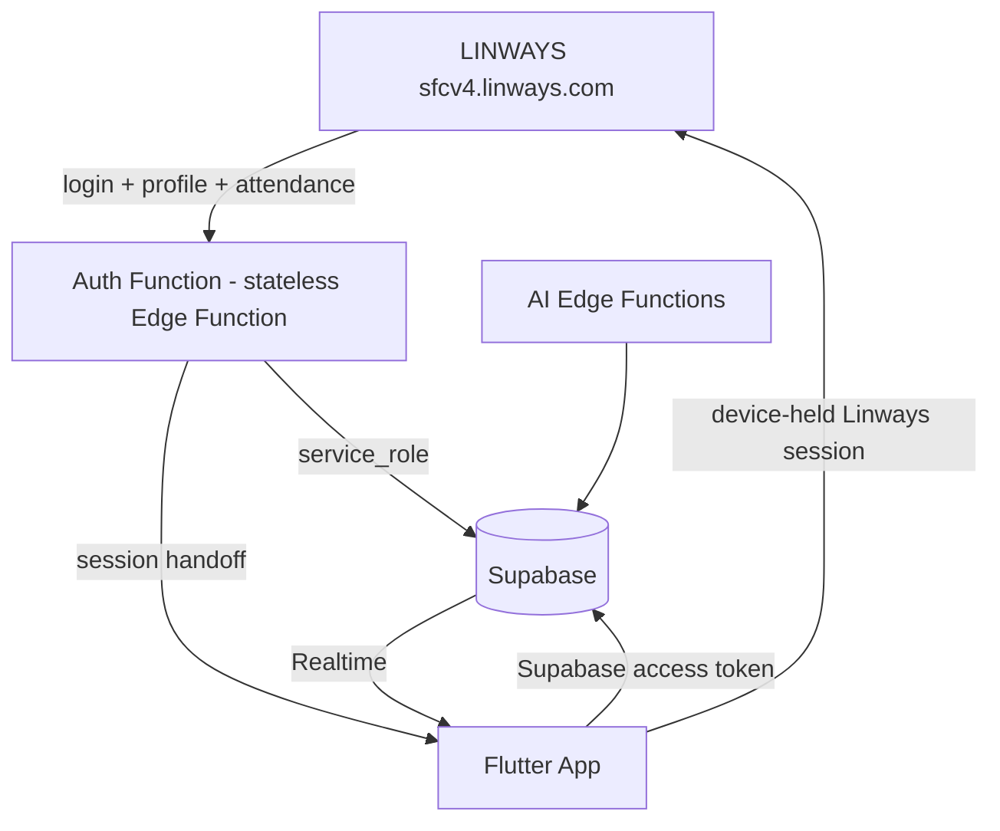

# Master Architecture — college project

> **Permanent mental model for the college project.** This document is the fixed frame of reference for every implementation decision.
> **Source of truth:** the approved architecture documents — `SYSTEM_ARCHITECTURE.md`, `DATABASE_DESIGN.md` (v1 + v2), `AUTHENTICATION_ARCHITECTURE.md`, `LINWAYS_INTEGRATION_ARCHITECTURE.md`, `ADR-004-Linways-Community.md`, `RLS_POLICIES.md` (u1–u23), `REPORT_LIFECYCLE.md` (D1–D10), `JWT_AUTH_COMPATIBILITY.md` (u22), and the applied schema (16 migrations).
> **Status: APPROVED mental model. Documentation only — no SQL, no migrations, no app/auth changes.**

---

## Table of Contents

1. [The One-Line Product](#1-the-one-line-product)
2. [System Overview](#2-system-overview)
3. [Responsibilities: Linways vs College Project](#3-responsibilities-linways-vs-college-project)
4. [Identity & Community Derivation](#4-identity--community-derivation)
5. [Supabase Auth & Identity Model](#5-supabase-auth--identity-model)
6. [Student Login & Dashboard Flow](#6-student-login--dashboard-flow)
7. [Attendance](#7-attendance)
8. [Community & Report System](#8-community--report-system)
9. [Report Lifecycle & Assignment](#9-report-lifecycle--assignment)
10. [Activity, Evidence, AI, Notifications](#10-activity-evidence-ai-notifications)
11. [Authority Panel](#11-authority-panel)
12. [Security & RLS](#12-security--rls)
13. [Server-Generated Paths](#13-server-generated-paths)
14. [Scope Separation: MVP vs Deferred](#14-scope-separation-mvp-vs-deferred)
15. [Non-Negotiable Architecture Rules](#15-non-negotiable-architecture-rules)

---

## 1. The One-Line Product

> **Linways proves who the student is → our system determines their class community → Supabase manages that community and all reports → authorities resolve those reports → Linways only supplies identity/academic information and attendance.**

This is **one college project** — not a Linways clone, not an attendance app. Linways is a source of identity and academic data; everything about communities, reports, workflow, comments, supports, evidence, notifications, and AI belongs to the college project.

---

## 2. System Overview



- **Linways** — external identity source (login credentials, academic profile, overall attendance).
- **College Project Auth Function** — stateless login handshake: verifies Linways identity, derives community, syncs profile/membership, establishes a native Supabase Auth session, hands it to the app once.
- **Flutter App** — two panels: Student Panel and Authority Panel (one authority architecture, not four separate apps).
- **Supabase** — Auth, PostgreSQL, RLS, Storage, Realtime, Edge Functions. Owns all college project data.

---

## 3. Responsibilities: Linways vs College Project

### 3.1 Linways responsibilities (external)

| Responsibility | Confirmed endpoint / data |
|---|---|
| Student authentication | `POST /academics/api/v1/auth/student-login-credentials` (UUCMS credentials) |
| Verified student academic/profile information | `GET /academics/api/v1/student/get-my-profile-details` — name, rollNo, registerNo, programme, batchName, currentSem, email |
| Overall attendance percentage | `GET /academics/api/v1/student/get-my-attendance-summary` — `attendancePercentage` (e.g. `89.11`) |

### 3.2 Linways does NOT manage (explicit)

Linways does **not** manage or store anything about:

- **Communities** — owned by the college project (`communities`, `community_members`)
- **Reports** — owned by the college project (`reports`)
- **Comments** — owned by the college project (`report_comments`)
- **Supports** — owned by the college project (`report_supports`)
- **Assignments** — owned by the college project (`report_assignments`)
- **Evidence** — owned by the college project (Supabase Storage + `evidence_files`)
- **Notifications** — owned by the college project (`notifications`)
- **Report status/workflow** — owned by the college project (lifecycle state machine)

Reports are never sent to Linways. Linways knows nothing about them.

### 3.3 College project responsibilities

- Community model and membership
- Report creation, visibility, lifecycle, assignment, workflow
- Comments, supports, evidence, activity/audit, notifications
- AI classification/priority/duplicate detection (assistive only)
- Identity linkage into Supabase (`auth.users` / `profiles`)
- RLS-enforced security boundaries
- Authority panel functionality

---

## 4. Identity & Community Derivation

### 4.1 Identity chain

```
Linways login → verified academic profile → derive community (server-side)
→ profiles / communities / community_members (service_role writes)
→ native Supabase Auth session
```

### 4.2 Community derivation — server-side only

The community is **derived from verified Linways academic data**, never chosen by the student (locked decision 7 — `community_pending` fallback for unmappable cases; client never picks its class).

| Community field | Source | Example |
|---|---|---|
| `course_code` | `batchName` (leading token; `programme` fallback) | `BCA` |
| `batch_year` | `batchName` (year token) | `2024` |
| `semester` | `currentSem` | `S5` |
| `section` | `batchName` (trailing token) | `C` |

**`BCA 2024 S5 C` ≠ `BCA 2024 S6 C` ≠ `BCA 2024 S5 A` ≠ `BBA 2025 S3 B`.** A community is one academic class/section for one batch/year in one semester.

### 4.3 Idempotent community creation & membership

- `communities` key: `UNIQUE (course_code, batch_year, semester, section)` — two students logging in must never create duplicate communities; get-or-create is idempotent.
- `community_members`: `UNIQUE (community_id, profile_id)`, `is_active` marks the current membership, `joined_at`/`left_at` preserve history. Membership is automatic (derived), recorded at login by the auth service — never by the client.
- A student has exactly **one active community** for MVP.

---

## 5. Supabase Auth & Identity Model

Approved via `JWT_AUTH_COMPATIBILITY.md` (u22):

1. **Native Supabase Auth sessions.** The auth Edge Function provisions the user via the Auth Admin API (`admin.createUser`, deterministic email from `registerNo`, random server-only password, `email_confirm: true`), writes `profiles` with the returned user id, then mints a real session (`admin.generateLink` magiclink → `verifyOtp`) and hands `{ access_token, refresh_token }` to the app once.
2. **Identity model:** `auth.users.id = profiles.id = auth.uid()` — by construction, 1:1.
3. Linways remains the **external identity source**; Supabase Auth provides the **authenticated session** used by the college project and RLS.
4. The auth service is **stateless** — server retains nothing after the handshake; the app stores the Supabase session and the Linways session cookies in FlutterSecureStorage (encrypted). Linways secrets are never stored server-side (locked decision 10).
5. Token expiry/renewal: standard Supabase SDK refresh flow. Logout: `signOut()` (refresh token revoked server-side); Linways cookies discarded on-device.

---

## 6. Student Login & Dashboard Flow

1. Student opens the app → **Student Login** (Student ID + password) — their existing **Linways credentials**, not a college project password.
2. Flutter → College Project Auth Function → Linways `student-login-credentials`. Failure → login error shown. Success → continue.
3. Auth Function fetches `get-my-profile-details`, derives community (server-side), upserts `profiles` + get-or-create `communities` + active `community_members` via `service_role`.
4. Auth Function establishes the native Supabase Auth session and returns `{ supabase_session, profile, community, linways_session_cookies }` to the app once.
5. Student enters the **dashboard**:
   - Greeting + community (e.g. "Good morning, Santhosh — BCA 2024 S5 C")
   - **Attendance** (overall % from Linways — see §7)
   - **Community Reports** (reports in their community)
   - **My Reports** (own reports, including historical ones from previous communities — RLS u1)
   - **Notifications** (own, read/unread)

---

## 7. Attendance

- Attendance is a **dashboard feature**, not part of the report system.
- The app calls Linways directly with the device-held session: `get-my-attendance-summary` → display `attendancePercentage` (e.g. `89.11`); short in-memory cache (TTL ~10–30 min) as the approved hybrid fallback.
- **Attendance is NOT stored in the MVP database.** No attendance tables, no subject-wise attendance, no history (locked decision 4).

---

## 8. Community & Report System

### 8.1 Report creation (community scope)

Student creates a report (title, description, category, subcategory, priority, evidence) in the college project app. The database records `reporter_id = profiles.id` and `community_id = <active community>` (NOT NULL snapshot at creation). Linways is not involved.

- MVP report type: **community reports only** (RLS u3). Private-report semantics are **deferred** — must not be implemented in MVP.
- `priority` is chosen by the student; AI may predict/recommend but must not silently overwrite (u4).
- New reports are created `status = 'pending'`.

### 8.2 Community isolation

- Students see reports where `community_id` = their active community, **plus their own historical reports** from previous communities (u1).
- Students never see soft-deleted reports (u2).
- Cross-community access is impossible by design — RLS is the enforcement boundary (§12).

### 8.3 Supports, comments, evidence

- **Supports** (`report_supports`): one per student per report (`UNIQUE(report_id, supporter_id)`); no self-support (u10); only on open reports `pending/under_review/in_progress` (u11); staff cannot support (u12); students may withdraw their own (u13).
- **Comments** (`report_comments`): no editing in MVP (u14); authors may delete their own; admin moderates.
- **Evidence** (`evidence_files` + Supabase Storage): students upload evidence **only to reports they own** (u16); deletion/moderation admin-only for MVP (u17).

---

## 9. Report Lifecycle & Assignment

### 9.1 State machine (approved — D1–D10)

```
pending → under_review → in_progress → resolved → closed
```

- **Forward path:** `pending → under_review → in_progress → resolved → closed`. `resolved` is reachable **only** via `in_progress` — there is no direct `pending → resolved` transition (amendment) and no `under_review → resolved` (D2).
- **Rejection:** `pending/under_review/in_progress → rejected`.
- **Reopening (O/A only, new active assignment required):** `rejected → under_review | in_progress` (D4); `resolved → under_review | in_progress` (D5).
- **Closed is terminal** — no transitions out, including admin (D6).
- **Cancellation/soft-delete:** a student may soft-delete their own **pending** report (u8); staff/admin may moderate per authority; admin restores; students never see deleted reports.
- H/T may perform forward/reject transitions on reports they can see (D7); **only O/A may assign** (u9); students have no status transitions (u6).

### 9.2 Assignment history (`report_assignments`)

- Assignment history is stored in `report_assignments`, **not** a column on `reports`.
- The current assignment is the row with `active = true`; reassignment deactivates the previous row, preserving history.
- An **active assignment is required** to move to `in_progress`; resolve/reject/close deactivate it; reopen requires a **new** assignment (D8).

---

## 10. Activity, Evidence, AI, Notifications

- **Audit/activity** (`report_activity`): every state-changing event appends a row — `status_change` (`metadata: {from_status, to_status}`), `created`, `assigned`, `unassigned`, `soft_deleted`, `restored`. Append-only; no client writes (u15).
- **Evidence** (`evidence_files`): file metadata in the DB, files in Supabase Storage (bucket policies are a separate phase).
- **AI** (`ai_classification_log`): runs **after** report creation; predicts category, priority, duplicate (with confidence + reasoning); logged append-only; admin-only read (u18); **assistive only** — AI never replaces the authority workflow or overrides the student's data.
- **Notifications** (`notifications`): server-generated on events (report new, assignment, status change, reopen, deletion, restore); users read/dismiss their own (u19); no client writes.

---

## 11. Authority Panel

One authority architecture for HOD / Technician / Operations / Admin — permissions differ, the app is one system.

| Role | Permissions (MVP) |
|---|---|
| **HOD / Technician** | Receivers/readers: view routed/assigned reports, review, comment, update status (forward/reject per lifecycle), view evidence, view activity. **Not** manual assigners (u9). |
| **Operations** | All H/T capabilities, **plus** assign/reassign, reopen reports, operational workflow handling. |
| **Admin** | Everything: all reports (incl. soft-deleted), all communities, users, membership, categories, routes, moderation, restore, system management. |

Staff visibility follows **category routing** (`category_routes`) + **assignments** (`report_assignments`); department-specific staff scoping is deferred (u23).

---

## 12. Security & RLS

- RLS is the **final security boundary** — the app is never trusted to enforce isolation.
- Identity chain inside policies: `auth.uid()` → `profiles.id` → role/membership helpers → `community_id` → allowed reports.
- All RLS decisions are approved (u1–u23, `RLS_POLICIES.md`); the approved lifecycle constrains staff status UPDATE policies (`REPORT_LIFECYCLE.md`).
- Role is **database-controlled** (`profiles.role` via `SECURITY DEFINER` helpers) — never trusted from the client or from user-modifiable JWT metadata.
- Community identity is derived server-side and never client-supplied.

---

## 13. Server-Generated Paths

- **`report_activity`** — server-generated only (triggers `SECURITY DEFINER` or `service_role`). `actor_id` is set server-side; **no direct client INSERT/UPDATE/DELETE** (u15). Prevents spoofed actors and forged history.
- **`notifications`** — server-generated only (same service/trigger path). No direct client INSERT; users only read/dismiss their own (u19).
- **`ai_classification_log`** — written only by the AI Edge Function via `service_role`; admin-only read (u18).

---

## 14. Scope Separation: MVP vs Deferred

### ✅ MVP (approved, in-scope)

- Linways login + profile + attendance (display-only)
- Community derivation, idempotent provisioning, automatic membership
- Native Supabase Auth sessions; `auth.users.id = profiles.id = auth.uid()`
- Community reports only (create, view, support, comment, evidence, activity)
- Lifecycle: pending → under_review → in_progress → resolved → closed; rejected; O/A reopen; closed terminal
- Assignments by O/A; assignment history in `report_assignments`
- RLS per u1–u23 (implementation pending explicit authorization)
- Server-generated activity + notifications
- AI classification/priority/duplicate detection (assistive, logged)
- Authority panel (H/T receive + forward transitions; O assign/reopen; A everything)
- Realtime subscriptions (later in roadmap)

### ⏸️ Deferred / Future (explicitly NOT in MVP)

- **Private-report semantics** (RLS u3) — do not implement
- Staff (H/T/O/A) **provisioning and staff authentication** (locked decision 5)
- Staff department-specific scoping (u23)
- Attendance storage / subject-wise attendance / history (locked decision 4)
- Profile fields `rollNo`, `phone`, `image` (locked decision 6)
- Evidence **bucket** policies, comment editing, support-comment editing
- Report editing by students (u6), student reopen rights
- Server-side Linways session storage (locked decision 10 — never for MVP; revisit only if central control becomes a hard requirement)

---

## 15. Non-Negotiable Architecture Rules

1. Linways is the external identity/academic source.
2. Linways is NOT the report database.
3. Linways does NOT manage communities.
4. Linways does NOT manage comments, supports, evidence, assignments, notifications, or report status.
5. The college project owns all report/community functionality.
6. Students never manually choose their academic community.
7. Community is derived from verified Linways academic data (server-side only).
8. Student attendance is fetched from Linways and displayed; not stored in the MVP database.
9. Supabase Auth provides the authenticated session used by RLS.
10. `auth.users.id = profiles.id = auth.uid()`.
11. Never trust client-supplied role or community identity.
12. RLS is the final security boundary.
13. Community reports are isolated by community; students also see their own historical reports.
14. Private-report semantics are deferred — MVP is community reports only.
15. AI assists classification/priority/duplicate detection; it does not replace the authority workflow or override student data.
16. Report lifecycle follows the approved state machine (pending → under_review → in_progress → resolved → closed; rejected; O/A-only reopen; closed terminal).
17. Every important report transition is recorded in `report_activity`; `report_activity` and `notifications` are server-generated and not client-spoofable.
18. Closed reports are terminal.
19. Do not add Linways features that aren't required by the MVP.
20. Do not call the project PULSE, SafeBunk, or Campus Pulse — it is the **college project**.

---

## File Summary

- **File:** `docs/architecture/MASTER_ARCHITECTURE.md` (new)
- **Sections:** 15 — one-line product, system overview, responsibility split (Linways vs college project), identity & community derivation, Supabase Auth identity model, login/dashboard flow, attendance, community & report system, lifecycle & assignment, activity/evidence/AI/notifications, authority panel, RLS security boundary, server-generated paths, MVP vs Deferred scope separation, 20 non-negotiable rules.
- **Grounding:** uses only approved terminology and decisions (u1–u23, D1–D10, locked decisions 1–10, applied schema). No new requirements introduced.
- **Constraints honored:** documentation only — no migrations modified, no SQL, no Flutter/app/auth code, no Supabase changes.

**STOPPED** — awaiting your next instruction (the pending next step remains the RLS migration, pending explicit authorization).
