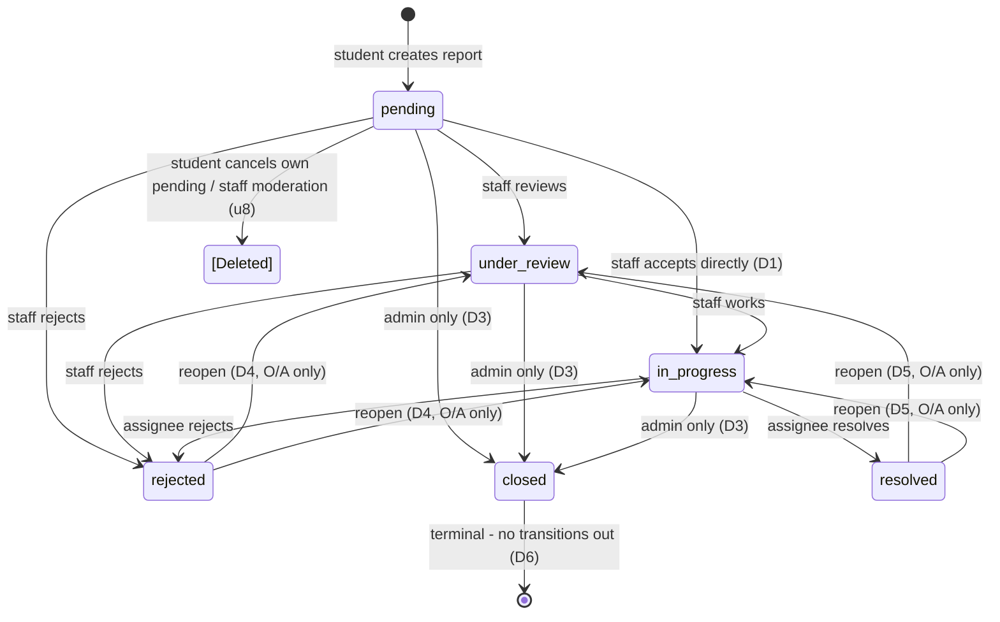

# Report Lifecycle & State Machine

> Complete lifecycle of a report from creation to resolution, including state transitions, actors, activity entries, and notifications.
> **Status: APPROVED (2026-08) — decisions D1–D9 approved with one amendment: the direct `pending → resolved` transition is removed entirely, including for Admin.**
> **NO implementation (no SQL, no DB changes, no app code). RLS staff UPDATE policies may reference this matrix once SQL generation is explicitly authorized.**

---

## Table of Contents

1. [Statuses](#1-statuses)
2. [State Machine Diagram](#2-state-machine-diagram)
3. [Transition Matrix](#3-transition-matrix)
4. [Reopen & Terminal Rules](#4-reopen--terminal-rules)
5. [Cancellation / Soft-Delete](#5-cancellation--soft-delete)
6. [Assignment Lifecycle on Status Change](#6-assignment-lifecycle-on-status-change)
7. [Activity Entries](#7-activity-entries)
8. [Notifications](#8-notifications)
9. [Decisions Record](#9-decisions-record)
10. [Impact on RLS & Handoff](#10-impact-on-rls--handoff)

---

## 1. Statuses

Defined by the `report_status` enum (migration `..._enums.sql`) — six values:

| Status | Meaning | Created by |
|---|---|---|
| `pending` | Report submitted; not yet reviewed or routed. | Student (report creation) |
| `under_review` | Staff acknowledged; assessment in progress. | Staff transition |
| `in_progress` | An assignee is actively working the report. | Staff transition (assignment expected) |
| `resolved` | Issue fixed/satisfied. | Staff transition (`in_progress → resolved`) |
| `rejected` | Not actionable / not valid / won't fix. | Staff transition |
| `closed` | Permanently closed (archived). | Staff transition |

Additional lifecycle state (not a `report_status` value): **soft-deleted** via `reports.deleted_at` (see §5). Students never see soft-deleted reports (RLS u2).

---

## 2. State Machine Diagram

**The normal forward lifecycle is: `pending → under_review → in_progress → resolved → closed`.**
There is **no direct `pending → resolved` transition** (amendment) and no `under_review → resolved` transition (D2) — `resolved` is only reachable via `in_progress`.

`[Deleted]` is the soft-delete state (`deleted_at` set) — it is not a status and has no transitions back except admin restore (`deleted_at = null`, status unchanged).

---

## 3. Transition Matrix

Legend: **S**=student, **H**=hod, **T**=technician, **O**=operations, **A**=admin. "Visible staff" = H/T/O/A who can see the report (category routing or active assignment).

| # | From → To | S | H | T | O | A | Notes |
|---|---|---|---|---|---|---|---|
| 1 | `pending → under_review` | — | ✅ | ✅ | ✅ | ✅ | Any visible staff may acknowledge |
| 2 | `pending → in_progress` | — | ✅ | ✅ | ✅ | ✅ | Direct acceptance without review (D1); active assignment required (D8) |
| 3 | `pending → rejected` | — | ✅ | ✅ | ✅ | ✅ | Rejection must carry reason in comments/notes |
| 4 | `pending → closed` | — | ❌ | ❌ | ❌ | ✅ | Direct close — admin only (D3) |
| 5 | `pending → resolved` | — | ❌ | ❌ | ❌ | ❌ | **REMOVED — no such transition, including for Admin** |
| 6 | `under_review → in_progress` | — | ✅ | ✅ | ✅ | ✅ | Work begins; active assignment required (D8) |
| 7 | `under_review → rejected` | — | ✅ | ✅ | ✅ | ✅ | |
| 8 | `under_review → closed` | — | ❌ | ❌ | ❌ | ✅ | Admin only (D3) |
| 9 | `under_review → resolved` | — | ❌ | ❌ | ❌ | ❌ | **Not allowed (D2)** — must pass through `in_progress` |
| 10 | `in_progress → resolved` | — | ✅ | ✅ | ✅ | ✅ | Fixed; active assignment deactivated (D8) |
| 11 | `in_progress → rejected` | — | ✅ | ✅ | ✅ | ✅ | Won't fix; active assignment deactivated (D8) |
| 12 | `in_progress → closed` | — | ❌ | ❌ | ❌ | ✅ | Admin only (D3) |
| 13 | `resolved → under_review` | — | ❌ | ❌ | ✅ | ✅ | Reopen (D5); new assignment required (D8) |
| 14 | `resolved → in_progress` | — | ❌ | ❌ | ✅ | ✅ | Reopen (D5); new assignment required (D8) |
| 15 | `rejected → under_review` | — | ❌ | ❌ | ✅ | ✅ | Reopen (D4); new assignment required (D8) |
| 16 | `rejected → in_progress` | — | ❌ | ❌ | ✅ | ✅ | Reopen (D4); new assignment required (D8) |
| 17 | `closed → *` | — | ❌ | ❌ | ❌ | ❌ | Terminal (D6) |
| — | `* → soft-deleted` | ✅ own pending only | ✅ | ✅ | ✅ | ✅ | u8: student cancels own **pending**; staff/admin moderate per authority |
| — | `soft-deleted → *` (restore) | ❌ | ❌ | ❌ | ❌ | ✅ | Admin restore; status unchanged |

**Student:** no status transitions at all (u6). Their only lifecycle action is cancelling their own **pending** report (soft-delete, u8).

---

## 4. Reopen & Terminal Rules (approved)

| # | Question | Decision |
|---|---|---|
| 4 | Can `rejected` reports be reopened? | **Yes (D4)** — O or A only; target `under_review` or `in_progress`; a new active assignment is required (D8). Student cannot self-reopen. |
| 5 | Can `resolved` reports be reopened? | **Yes (D5)** — O or A only; target `under_review` or `in_progress`; a new active assignment is required (D8). |
| 6 | Are `closed` reports permanently closed? | **Yes (D6)** — terminal, **no transitions out, including admin**. Closed rows are archival; a fresh report is the only path. |

---

## 5. Cancellation / Soft-Delete

- **Student cancels own pending report** (approved u8): sets `reports.deleted_at`; `status` remains `pending`. Students never see deleted rows (RLS u2).
- **Staff/admin moderation** (approved u8): authorized staff may soft-delete per their authority (H/T/O on visible reports; admin on any). Deletion does **not** change `status`.
- **Restore:** admin only — clears `deleted_at`; status unchanged.
- Soft-delete is the **only** way reports are ever removed; hard `DELETE` is never allowed (RLS matrix).

---

## 6. Assignment Lifecycle on Status Change (approved, D8)

Rules (aligned with u9 — O/A assign; H/T are receivers):

| Event | Assignment behavior |
|---|---|
| `pending → under_review` | No assignment change (review may precede assignment) |
| `→ in_progress` | An **active** assignment (`report_assignments` where `active = true`, created by O/A) is **required** before/at this transition. Without one, the transition is rejected. |
| `→ resolved` / `→ rejected` | Active assignment deactivated (`active = false`) — the record remains for history. |
| `→ closed` | Active assignment deactivated. |
| Reopen (`→ under_review` / `→ in_progress`) | Previous assignment stays deactivated; O/A must create a **new** active assignment. |
| Assignment changes while open | O/A only (u9); prior `active` row deactivated (`active = false`), new row `active = true`; `assigned_at`/`notes` recorded. |

Assignment lifecycle events are server-generated activity entries (§7) — no direct client writes (RLS u15).

---

## 7. Activity Entries

Every state-changing event appends one row to `report_activity` (server-generated, RLS u15). `actor_id` is always the acting profile; `metadata` is JSONB.

| Event | `activity_type` | `metadata` (approved) |
|---|---|---|
| Report created | `created` | `{ "report_type": "community" }` |
| Status transition | `status_change` | `{ "from_status": <old>, "to_status": <new> }` |
| Report rejected | `status_change` | `{ "from_status": ..., "to_status": "rejected", "reason": <optional> }` |
| Report reopened | `status_change` | `{ "from_status": ..., "to_status": <new>, "reason": <optional> }` |
| Assignment created | `assigned` | `{ "assigned_to": <uuid>, "notes": <optional> }` |
| Assignment deactivated | `unassigned` | `{ "assigned_to": <uuid> }` |
| Soft-delete (cancel/moderation) | `soft_deleted` | `{ "deleted_by": "student" \| "staff" }` |
| Restore | `restored` | `{ }` |
| (Support / comment / evidence) | `supported` / `commented` / `evidence` | per feature — outside this doc's scope |

No UPDATE/DELETE on `report_activity` ever (append-only).

---

## 8. Notifications (approved, D9)

Server-generated via `notifications` (RLS: user reads own; INSERT server-side).

| Event | Recipients | `type` / `reference_id` |
|---|---|---|
| Report created | Staff whose role the category routes to (in `category_routes` priority order) | `type: 'report_new'`, `reference_id: report_id` |
| `pending → under_review` | Reporter | `type: 'status_change'` |
| `pending → in_progress` | Reporter + active assignee | `type: 'status_change'` |
| `pending → rejected` | Reporter | `type: 'status_change'` |
| `under_review → in_progress` | Reporter + active assignee | `type: 'status_change'` |
| `under_review → rejected` | Reporter | `type: 'status_change'` |
| `in_progress → resolved` | Reporter | `type: 'status_change'` |
| `in_progress → rejected` | Reporter | `type: 'status_change'` |
| `→ closed` | Reporter | `type: 'status_change'` |
| Reopen | Reporter + staff in the report's routing | `type: 'status_change'` |
| Assignment created | New assignee | `type: 'assignment'` |
| Assignment deactivated | Former assignee | `type: 'assignment'` |
| Soft-delete (cancel) | None (student self-action); routed staff when staff-initiated | `type: 'report_deleted'` |
| Restore | Reporter | `type: 'report_restored'` |

Notes:
- Notification rows are created **server-side at the same moment as the activity entry** (same trigger/service path — u15).
- Community broadcasts are out of MVP scope; recipients above are individuals only.

---

## 9. Decisions Record

All decisions are **APPROVED** (2026-08). D1–D9 approved with one amendment: **`pending → resolved` removed entirely (including Admin)** — reflected in §2/§3.

| # | Decision | Approved answer |
|---|---|---|
| D1 | `pending → in_progress` without `under_review` | **Allowed** — staff may accept directly |
| D2 | `under_review → resolved` skipping `in_progress` | **Not allowed** — must pass through `in_progress` |
| D3 | Direct `→ closed` from any open status | **Admin only** (H/T/O cannot close) |
| D4 | `rejected` reopen | **Allowed** — O/A only; target `under_review` or `in_progress` |
| D5 | `resolved` reopen | **Allowed** — O/A only; target `under_review` or `in_progress` |
| D6 | `closed` permanence | **Terminal for everyone, including admin** — no transitions out |
| D7 | H/T forward-transition rights | **Allowed** — H/T may perform forward transitions on visible reports; only O/A may assign (u9 unchanged) |
| D8 | Assignment rules | `in_progress` requires active assignment; resolve/reject/close deactivate it; reopen requires a new assignment |
| D9 | Notification recipients | **As proposed in §8** |
| D10 | `pending → resolved` | **REMOVED entirely** — no such transition, including for Admin (amendment to the proposal) |

---

## 10. Impact on RLS & Handoff

- This document clears the **u7 dependency** in `docs/architecture/RLS_POLICIES.md` §5.
- On approval of RLS SQL generation, staff `reports` UPDATE policies will be constrained to the transitions above via a `SECURITY DEFINER` transition-validation helper, plus the staff soft-delete rules (u8).
- The RLS matrix requires no changes — it was already designed against these rules (u5, u6, u8, u9, u10, u11, u15).

*Documentation only — no SQL, no database changes, no Flutter code, no authentication implementation.*
